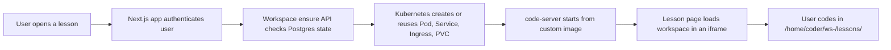

# CodeForge


**CodeForge** is an interactive lesson platform that pairs step-by-step coding guides with a **live, per-user VS Code workspace** running in Kubernetes. Users open a lesson, sign in, and start coding in the browser without local setup.

## Why CodeForge

- **Live coding environment** embedded next to lesson content
- **Dedicated workspace per user** backed by Pod, Service, Ingress, and PVC resources
- **Next.js 16 App Router** frontend with server-driven orchestration
- **Better Auth + PostgreSQL** for authentication and workspace state
- **Resettable workspaces** with versioned paths to avoid stale editor state
- **Automatic cleanup** for idle environments

## How it works



### Runtime flow

1. A user opens `/lessons/[slug]`.
2. The lesson page authenticates the user and stays dynamic with `await connection()`.
3. The app ensures a code-server workspace exists for that user.
4. Kubernetes provisions or reuses deterministic `cs-<slug>` resources.
5. The frontend polls workspace status and loads the lesson-scoped folder in an iframe.
6. A cleanup CronJob removes stale runtime resources after the idle timeout.

## Feature highlights

### In-browser lessons

Lesson content lives in `data/lessons.ts` and is rendered alongside the workspace. The current starter lessons focus on practical UI building tasks such as layouts and hero sections, with support for shared starter templates.

### Per-user workspaces

Each authenticated user gets an isolated code-server instance with a persistent volume. Workspace URLs are generated from a deterministic user slug, and reset operations move the editor to a new `ws-<resetCount>` path.

### Kubernetes-native orchestration

The app creates and manages Pods, Services, Ingresses, PVCs, and cleanup jobs directly through the Kubernetes API instead of proxying traffic through Next.js.

## Tech stack

| Layer | Stack |
| --- | --- |
| Frontend | Next.js 16, React 19, TypeScript |
| Auth | Better Auth |
| Database | PostgreSQL (`pg`) |
| Lesson rendering | `react-markdown`, `remark-gfm` |
| Workspace runtime | `code-server` in Kubernetes |
| Infra | Kustomize, cert-manager, Traefik |

## Project structure

```text
app/                    App Router pages and route handlers
components/             UI components for lessons, auth, layout, and iframe UX
data/                   Lesson metadata and markdown step content
lib/                    Auth, DB, K8s client, and workspace orchestration
code-server/            Custom code-server image and workspace entrypoint
k8s/                    Kustomize base/overlays, TLS manifests, secret examples
docs/                   Infra and deployment runbooks
UPDATE.md               Operations and troubleshooting guide
```

## Quick start

### 1. Install dependencies

```bash
pnpm install
cp .env.example .env.local
```

### 2. Configure local environment

At minimum, set these values in `.env.local`:

```bash
BETTER_AUTH_SECRET=
BETTER_AUTH_URL=http://localhost:3000
DATABASE_URL=
CODE_SERVER_DOMAIN=
CODE_SERVER_TLS_SECRET=
CODE_SERVER_IMAGE=ghcr.io/dedkola/codeforge-cs:latest
CODE_SERVER_CLEANUP_SECRET=
K8S_NAMESPACE=codelearn
```

Optional OAuth providers are supported through GitHub and Google client credentials.

### 3. Start the app

```bash
pnpm dev
```

### 4. Open a lesson

Visit `http://localhost:3000`, sign in, and open a lesson from `/lessons`.

## Running with Kubernetes

CodeForge expects a Kubernetes cluster for live workspaces. The app can connect to Kubernetes in three ways:

- **Local development with kubeconfig**: leave `K8S_API_SERVER` and `K8S_AUTH_TOKEN` unset
- **In-cluster deployment**: rely on the pod ServiceAccount
- **External app deployment**: set `K8S_API_SERVER`, `K8S_AUTH_TOKEN`, and optional TLS settings

### Core deployment steps

```bash
kubectl apply -k k8s
```

You will also need:

- a wildcard domain for per-user workspace hosts
- cert-manager for TLS issuance
- a populated `k8s/secrets.yaml` based on `k8s/secrets.yaml.example`
- the custom code-server image from `code-server/`

For the full infrastructure flow, use the docs linked below.

## Commands

```bash
pnpm dev
pnpm lint
pnpm build
pnpm start
```

There is currently **no automated test suite** in the repository.

## Documentation

- [`UPDATE.md`](./UPDATE.md) - operations, rollout, and troubleshooting
- [`k8s/README.md`](./k8s/README.md) - Kubernetes layout and required secrets
- [`code-server/README.md`](./code-server/README.md) - custom workspace image details
- [`docs/K3S-CLOUDFLARE-TUNNEL-API-ACCESS.md`](./docs/K3S-CLOUDFLARE-TUNNEL-API-ACCESS.md) - remote Kubernetes API access

## Development notes

- Import workspace actions from `@/lib/code-server-manager`
- Use `buildCodeServerUrl()` instead of assembling workspace URLs by hand
- Resolve lesson template slugs before building workspace folder paths
- `instrumentation.ts` bootstraps the workspace state table on Node.js startup

## Contributing

Contributions that improve lessons, workspace reliability, auth flows, or deployment ergonomics are a good fit for this repo. Keep changes focused, document infra updates, and use `pnpm lint` and `pnpm build` before opening a PR.
